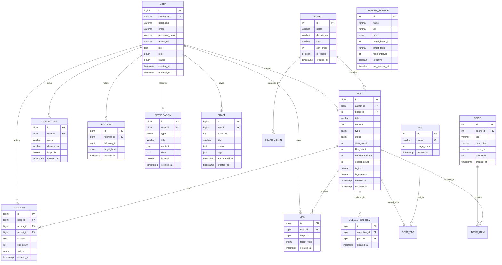

# 缘圈子 - 内部学习型论坛系统设计文档

## 1. 概述

### 1.1 设计目标
本文档基于需求文档，为"缘圈子"内部学习型论坛系统提供详细的技术设计方案，包括系统架构、数据模型、接口定义和实现策略。

### 1.2 技术选型决策

| 组件 | 选型 | 理由 |
|------|------|------|
| 前端框架 | React 18 + TypeScript | 组件化、类型安全、生态丰富 |
| UI组件库 | Ant Design | 企业级组件、内置中文化 |
| 后端框架 | Node.js + NestJS | 模块化架构、TypeScript原生支持 |
| 数据库 | PostgreSQL 15 | ACID支持、JSON字段、全文检索扩展 |
| 缓存 | Redis 7 | 会话存储、热点数据缓存、消息队列 |
| 搜索引擎 | MeiliSearch | 轻量级、开箱即用、支持中文 |
| 文件存储 | 本地存储 + MinIO | 私有化部署友好 |
| 消息队列 | BullMQ (Redis) | 基于Redis、TypeScript支持 |
| 容器化 | Docker + Compose | 简化部署、环境一致 |

---

## 2. 系统架构

### 2.1 整体架构图

```
┌─────────────────────────────────────────────────────────────────────┐
│                              客户端层                                │
│  ┌──────────────┐  ┌──────────────┐  ┌──────────────┐               │
│  │   Web PC     │  │   Mobile     │  │    IM Bot    │               │
│  │  (React)     │  │ (Responsive) │  │  (Webhook)   │               │
│  └──────┬───────┘  └──────┬───────┘  └──────┬───────┘               │
└─────────┼────────────────┼────────────────┼─────────────────────────┘
          │                │                │
          └────────────────┴────────────────┘
                           │
┌──────────────────────────▼──────────────────────────────────────────┐
│                            网关层                                    │
│                    Nginx (反向代理/负载均衡)                          │
└──────────────────────────┬──────────────────────────────────────────┘
                           │
┌──────────────────────────▼──────────────────────────────────────────┐
│                           应用层                                     │
│  ┌───────────────────────────────────────────────────────────────┐  │
│  │                     NestJS API Server                         │  │
│  │  ┌──────────┐ ┌──────────┐ ┌──────────┐ ┌──────────┐          │  │
│  │  │  Auth    │ │ Content  │ │  Social  │ │  Admin   │          │  │
│  │  │ Module   │ │ Module   │ │ Module   │ │ Module   │          │  │
│  │  └────┬─────┘ └────┬─────┘ └────┬─────┘ └────┬─────┘          │  │
│  │       └────────────┴────────────┴────────────┘                │  │
│  │                              │                                │  │
│  │                       ┌──────┴──────┐                         │  │
│  │                       │   Guards    │                         │  │
│  │                       │ Middleware  │                         │  │
│  │                       │ Interceptors│                         │  │
│  │                       └─────────────┘                         │  │
│  └───────────────────────────────────────────────────────────────┘  │
└──────────────────────────┬──────────────────────────────────────────┘
                           │
           ┌───────────────┼───────────────┐
           │               │               │
┌──────────▼─────────┐ ┌───▼──────────┐ ┌──▼────────────────┐
│     数据层          │ │   缓存层      │ │    消息队列层      │
│  ┌──────────────┐  │ │ ┌──────────┐ │ │  ┌──────────────┐ │
│  │ PostgreSQL   │  │ │ │  Redis   │ │ │  │   BullMQ     │ │
│  │              │  │ │ │          │ │ │  │  (Jobs)      │ │
│  │ - Users      │  │ │ │- Sessions│ │ │  │              │ │
│  │ - Posts      │  │ │ │- Hot Data│ │ │  │- Notification│ │
│  │ - Comments   │  │ │ │- Rate Lim│ │ │  │- Content Crawl│ │
│  │ - Collections│  │ │ └──────────┘ │ │  │- Search Index │ │
│  └──────────────┘  │ └──────────────┘ │  └──────────────┘ │
└────────────────────┘ └────────────────┘ └───────────────────┘
           │               │               │
           └───────────────┼───────────────┘
                           │
┌──────────────────────────▼──────────────────────────────────────────┐
│                          外部服务                                    │
│  ┌──────────────┐  ┌──────────────┐  ┌──────────────┐               │
│  │  MeiliSearch │  │    SMTP      │  │   IM Webhook │               │
│  │  (Search)    │  │  (Email)     │  │   (Notify)   │               │
│  └──────────────┘  └──────────────┘  └──────────────┘               │
└─────────────────────────────────────────────────────────────────────┘
```

### 2.2 模块划分

```
src/
├── modules/
│   ├── auth/              # 认证授权模块
│   ├── user/              # 用户管理模块
│   ├── post/              # 内容管理模块
│   ├── comment/           # 评论互动模块
│   ├── interaction/       # 互动模块（点赞、收藏）
│   ├── follow/            # 关注模块
│   ├── collection/        # 收藏夹模块
│   ├── topic/             # 专题模块
│   ├── notification/      # 通知模块
│   ├── search/            # 搜索模块
│   ├── admin/             # 系统管理模块
│   ├── crawler/           # 内容抓取模块
│   └── statistics/        # 数据统计模块
├── common/                # 公共组件
├── config/                # 配置文件
└── database/              # 数据库迁移和种子
```

---

## 3. 数据模型

### 3.1 实体关系图 (ER Diagram)



### 3.2 核心表结构

#### 用户表 (users)
```sql
CREATE TABLE users (
    id BIGSERIAL PRIMARY KEY,
    student_no VARCHAR(20) UNIQUE NOT NULL,
    username VARCHAR(50) NOT NULL,
    email VARCHAR(100),
    password_hash VARCHAR(255) NOT NULL,
    avatar_url VARCHAR(255),
    bio TEXT,
    role ENUM('admin', 'board_admin', 'user') DEFAULT 'user',
    status ENUM('active', 'inactive', 'banned') DEFAULT 'active',
    last_login_at TIMESTAMP,
    created_at TIMESTAMP DEFAULT CURRENT_TIMESTAMP,
    updated_at TIMESTAMP DEFAULT CURRENT_TIMESTAMP
);
```

#### 内容表 (posts)
```sql
CREATE TABLE posts (
    id BIGSERIAL PRIMARY KEY,
    author_id BIGINT NOT NULL REFERENCES users(id) ON DELETE CASCADE,
    board_id INTEGER NOT NULL REFERENCES boards(id),
    title VARCHAR(200) NOT NULL,
    content TEXT NOT NULL,
    type ENUM('original', 'repost', 'crawler') DEFAULT 'original',
    status ENUM('draft', 'pending', 'approved', 'rejected', 'hidden') DEFAULT 'pending',
    source_url VARCHAR(500),
    view_count INTEGER DEFAULT 0,
    like_count INTEGER DEFAULT 0,
    comment_count INTEGER DEFAULT 0,
    collect_count INTEGER DEFAULT 0,
    is_top BOOLEAN DEFAULT FALSE,
    is_essence BOOLEAN DEFAULT FALSE,
    created_at TIMESTAMP DEFAULT CURRENT_TIMESTAMP,
    updated_at TIMESTAMP DEFAULT CURRENT_TIMESTAMP
);
```

#### 互动表 (likes)
```sql
CREATE TABLE likes (
    id BIGSERIAL PRIMARY KEY,
    user_id BIGINT NOT NULL REFERENCES users(id) ON DELETE CASCADE,
    target_id BIGINT NOT NULL,
    target_type ENUM('post', 'comment') NOT NULL,
    created_at TIMESTAMP DEFAULT CURRENT_TIMESTAMP,
    UNIQUE(user_id, target_id, target_type)
);
```

### 3.3 索引设计

| 表 | 索引字段 | 类型 | 用途 |
|----|----------|------|------|
| users | student_no | UNIQUE | 学号登录 |
| users | email | UNIQUE | 邮箱找回密码 |
| posts | author_id + created_at | BTREE | 用户内容列表 |
| posts | board_id + is_top + created_at | BTREE | 板块内容列表 |
| posts | status + created_at | BTREE | 审核队列 |
| comments | post_id + created_at | BTREE | 文章评论列表 |
| likes | user_id + target_type | BTREE | 用户互动查询 |
| likes | target_id + target_type | BTREE | 目标互动统计 |
| follows | follower_id + target_type | BTREE | 用户关注列表 |
| follows | following_id + target_type | BTREE | 粉丝列表 |
| notifications | user_id + is_read + created_at | BTREE | 未读通知 |

---

## 4. API 接口设计

### 4.1 认证模块 (/api/auth)

```typescript
// 登录
POST /auth/login
Request:  { studentNo: string, password: string, rememberMe?: boolean }
Response: { accessToken: string, refreshToken: string, user: UserInfo }

// 登出
POST /auth/logout
Headers:  { Authorization: Bearer ${token} }
Response: { message: "success" }

// 刷新令牌
POST /auth/refresh
Request:  { refreshToken: string }
Response: { accessToken: string, refreshToken: string }

// 修改密码
POST /auth/change-password
Headers:  { Authorization: Bearer ${token} }
Request:  { oldPassword: string, newPassword: string }
```

### 4.2 用户模块 (/api/users)

```typescript
// 获取当前用户信息
GET /users/me
Response: { id, studentNo, username, email, avatarUrl, bio, role, stats: {...} }

// 更新用户信息
PATCH /users/me
Request:  { username?, email?, bio?, avatar? }

// 获取用户主页
GET /users/:id/profile
Response: { user, posts: [...], stats: {...} }

// 获取学习档案
GET /users/me/stats
Response: { 
  readingTime, postCount, commentCount, 
  likeCount, collectCount, monthlyReport, badges: [...] 
}
```

### 4.3 内容模块 (/api/posts)

```typescript
// 获取文章列表
GET /posts?page=1&limit=20&boardId=&tag=&sort=new|hot
Response: { items: [...], pagination: {...} }

// 获取文章详情
GET /posts/:id
Response: { id, title, content, author, board, tags, stats, ... }

// 创建文章
POST /posts
Request:  { title, content, boardId, tags[], type, visibility }
Response: { id, ... }

// 更新文章
PATCH /posts/:id
Request:  { title?, content?, boardId?, tags? }

// 删除文章
DELETE /posts/:id

// 点赞/取消点赞
POST /posts/:id/like
DELETE /posts/:id/like

// 收藏/取消收藏
POST /posts/:id/collect
DELETE /posts/:id/collect
```

### 4.4 评论模块 (/api/comments)

```typescript
// 获取评论列表
GET /posts/:postId/comments
Response: { items: [...], pagination: {...} }

// 发表评论
POST /comments
Request:  { postId, content, parentId? }
Response: { id, ... }

// 删除评论
DELETE /comments/:id

// 点赞评论
POST /comments/:id/like
DELETE /comments/:id/like
```

### 4.5 搜索模块 (/api/search)

```typescript
// 全文搜索
GET /search?q=keyword&filters={...}&page=1
Response: { 
  items: [...], 
  pagination: {...},
  suggestions: [...]
}

// 热门搜索
GET /search/trending
Response: { items: [...] }

// 搜索建议
GET /search/suggestions?q=keyword
Response: { tags: [...], posts: [...], users: [...] }
```

### 4.6 管理模块 (/api/admin)

```typescript
// 用户管理
GET    /admin/users
PATCH  /admin/users/:id/status
PATCH  /admin/users/:id/role

// 内容审核
GET    /admin/posts/pending
POST   /admin/posts/:id/approve
POST   /admin/posts/:id/reject

// 板块管理
GET    /admin/boards
POST   /admin/boards
PATCH  /admin/boards/:id
DELETE /admin/boards/:id

// 数据统计
GET    /admin/statistics/overview
GET    /admin/statistics/posts
GET    /admin/statistics/users
GET    /admin/statistics/interactions
```

---

## 5. 核心业务逻辑

### 5.1 内容推荐算法

```typescript
// 内容权重计算
function calculatePostWeight(post: Post): number {
  const now = Date.now();
  const postAge = now - post.createdAt.getTime();
  const dayInMs = 24 * 60 * 60 * 1000;
  
  // 基础权重
  let weight = 
    post.likeCount * 2 +      // 点赞权重 2
    post.commentCount * 3 +   // 评论权重 3
    post.collectCount * 4 +   // 收藏权重 4
    post.viewCount * 0.1;     // 浏览权重 0.1
  
  // 时间衰减因子 (24小时内不衰减)
  const timeDecay = Math.max(1, postAge / dayInMs);
  weight = weight / Math.log1p(timeDecay);
  
  // 精华/置顶加权
  if (post.isEssence) weight *= 1.5;
  if (post.isTop) weight *= 2;
  
  return weight;
}

// 自动标签逻辑
function checkAutoLabel(post: Post, totalUsers: number): void {
  const likeRatio = post.likeCount / totalUsers;
  
  if (likeRatio >= 0.6) {
    post.canBeTop = true;        // 可申请置顶
  }
  if (likeRatio >= 0.5) {
    post.canBeEssence = true;    // 可申请加精
  }
  if (likeRatio >= 0.3) {
    post.isHot = true;           // 自动标记热门
  }
}
```

### 5.2 通知机制

```typescript
// 通知类型
enum NotificationType {
  COMMENT = 'comment',           // 收到评论
  REPLY = 'reply',               // 收到回复
  LIKE_POST = 'like_post',       // 文章被点赞
  LIKE_COMMENT = 'like_comment', // 评论被点赞
  COLLECT = 'collect',           // 文章被收藏
  FOLLOW = 'follow',             // 被关注
  AUDIT_RESULT = 'audit_result', // 审核结果
  SYSTEM = 'system',             // 系统公告
}

// 通知发送流程
async function sendNotification(
  userId: number,
  type: NotificationType,
  data: NotificationData
): Promise<void> {
  // 1. 保存到数据库
  const notification = await Notification.create({
    userId,
    type,
    ...data
  });
  
  // 2. 推送到消息队列 (异步处理)
  await notificationQueue.add('send', {
    notificationId: notification.id,
    channels: await getUserNotificationChannels(userId)
  });
  
  // 3. WebSocket实时推送
  wsServer.to(`user:${userId}`).emit('notification', notification);
}
```

### 5.3 内容审核流程

```
用户发布内容
    │
    ├─► 敏感词检测 ─► 命中 ─► 自动拒绝
    │
    ├─► 先发后审模式?
    │       ├── 是 ─► 直接发布，加入待审核队列
    │       └── 否 ─► 进入人工审核队列
    │
    └─► 审核通过 ─► 正式发布
    │
    └─► 审核拒绝 ─► 通知作者，可修改重提
```

---

## 6. 错误处理

### 6.1 错误码定义

| 错误码 | 描述 | HTTP状态 |
|--------|------|----------|
| 1001 | 参数错误 | 400 |
| 1002 | 未授权 | 401 |
| 1003 | 禁止访问 | 403 |
| 1004 | 资源不存在 | 404 |
| 1005 | 方法不允许 | 405 |
| 2001 | 用户名或密码错误 | 401 |
| 2002 | 账号已锁定 | 403 |
| 2003 | 令牌过期 | 401 |
| 3001 | 内容不存在 | 404 |
| 3002 | 无权操作此内容 | 403 |
| 3003 | 内容正在审核中 | 403 |
| 4001 | 操作过于频繁 | 429 |
| 5000 | 服务器内部错误 | 500 |

### 6.2 全局异常处理

```typescript
// 异常过滤器
@Catch()
export class GlobalExceptionFilter implements ExceptionFilter {
  catch(exception: any, host: ArgumentsHost) {
    const ctx = host.switchToHttp();
    const response = ctx.getResponse();
    const request = ctx.getRequest();
    
    let status = HttpStatus.INTERNAL_SERVER_ERROR;
    let errorCode = 5000;
    let message = '服务器内部错误';
    
    if (exception instanceof HttpException) {
      status = exception.getStatus();
      const res = exception.getResponse() as any;
      errorCode = res.code || status;
      message = res.message || exception.message;
    }
    
    // 记录错误日志
    this.logger.error({
      errorCode,
      message,
      path: request.url,
      method: request.method,
      timestamp: new Date().toISOString(),
      stack: exception.stack
    });
    
    response.status(status).json({
      success: false,
      errorCode,
      message,
      path: request.url,
      timestamp: new Date().toISOString()
    });
  }
}
```

---

## 7. 测试策略

### 7.1 测试层级

```
┌─────────────────────────────────────────┐
│         E2E Tests (Playwright)          │
│     模拟真实用户场景，覆盖核心流程        │
├─────────────────────────────────────────┤
│        Integration Tests (Jest)         │
│     API集成测试，数据库交互测试          │
├─────────────────────────────────────────┤
│          Unit Tests (Jest)              │
│     服务层、工具函数单元测试             │
└─────────────────────────────────────────┘
```

### 7.2 核心测试用例

| 模块 | 测试类型 | 覆盖场景 |
|------|----------|----------|
| Auth | E2E | 登录成功、登录失败锁定、密码修改、令牌刷新 |
| Post | Unit + Integration | CRUD、权限控制、状态流转、计数更新 |
| Comment | Unit | 嵌套回复、删除级联、点赞计数 |
| Like | Integration | 并发点赞、幂等性、计数一致性 |
| Search | Integration | 全文检索、过滤条件、性能测试 |
| Notification | Unit | 触发条件、渠道发送、已读状态 |

### 7.3 性能测试指标

```yaml
Load Testing:
  - 并发用户: 200
  - 持续时间: 10分钟
  - 目标:
      - 平均响应时间: < 200ms
      - P95响应时间: < 500ms
      - 错误率: < 0.1%

Stress Testing:
  - 逐步加压至: 500并发
  - 观察:
      - 系统吞吐量
      - 资源使用率
      - 降级表现
```

---

## 8. 部署架构

### 8.1 Docker Compose 配置

```yaml
version: '3.8'
services:
  # 前端
  web:
    build: ./web
    ports:
      - "80:80"
    depends_on:
      - api
    
  # API服务
  api:
    build: ./api
    environment:
      - NODE_ENV=production
      - DB_HOST=postgres
      - REDIS_HOST=redis
      - MEILISEARCH_HOST=meilisearch
    depends_on:
      - postgres
      - redis
      - meilisearch
    deploy:
      replicas: 2
    
  # 数据库
  postgres:
    image: postgres:15-alpine
    volumes:
      - postgres_data:/var/lib/postgresql/data
    environment:
      - POSTGRES_DB=yuanquanzi
      - POSTGRES_USER=app
      - POSTGRES_PASSWORD=${DB_PASSWORD}
      
  # 缓存
  redis:
    image: redis:7-alpine
    volumes:
      - redis_data:/data
      
  # 搜索引擎
  meilisearch:
    image: getmeili/meilisearch:v1.5
    volumes:
      - meilisearch_data:/meili_data
    environment:
      - MEILI_MASTER_KEY=${SEARCH_KEY}
      
  # 文件存储
  minio:
    image: minio/minio:latest
    command: server /data --console-address ":9001"
    volumes:
      - minio_data:/data

volumes:
  postgres_data:
  redis_data:
  meilisearch_data:
  minio_data:
```

### 8.2 备份策略

| 数据类型 | 备份频率 | 保留周期 |
|----------|----------|----------|
| 数据库全量 | 每日凌晨 | 30天 |
| 数据库增量 | 每6小时 | 7天 |
| 文件存储 | 实时同步 | 版本控制 |
| 配置文件 | 变更时 | 无限期 |

---

## 9. 安全设计

### 9.1 防护措施

```
┌────────────────────────────────────────────┐
│  Layer 1: 网络层                           │
│  - HTTPS强制                                 │
│  - DDoS防护 (Nginx限流)                      │
│  - IP黑名单                                  │
├────────────────────────────────────────────┤
│  Layer 2: 应用层                           │
│  - 接口限流 (Rate Limiting)                  │
│  - CORS配置                                  │
│  - 参数校验 (Validation)                     │
├────────────────────────────────────────────┤
│  Layer 3: 认证授权层                        │
│  - JWT + Refresh Token                       │
│  - 密码加密 (bcrypt)                         │
│  - 会话管理                                  │
├────────────────────────────────────────────┤
│  Layer 4: 数据层                           │
│  - SQL参数化                                 │
│  - XSS过滤 (DOMPurify)                       │
│  - 敏感数据脱敏                              │
└────────────────────────────────────────────┘
```

### 9.2 敏感数据处理

```typescript
// 密码处理
const bcrypt = require('bcrypt');
const SALT_ROUNDS = 12;

async function hashPassword(password: string): Promise<string> {
  return bcrypt.hash(password, SALT_ROUNDS);
}

// 响应脱敏
function sanitizeUser(user: User): SanitizedUser {
  const { passwordHash, email, ...safe } = user;
  return {
    ...safe,
    email: maskEmail(email) // 显示部分邮箱
  };
}
```

---

## 10. 监控与日志

### 10.1 监控指标

| 类别 | 指标 | 告警阈值 |
|------|------|----------|
| 性能 | API响应时间 | P95 > 500ms |
| 性能 | 数据库查询时间 | 平均 > 100ms |
| 可用性 | HTTP错误率 | > 1% |
| 资源 | CPU使用率 | > 80% |
| 资源 | 内存使用率 | > 85% |
| 业务 | 登录失败率 | > 10% |

### 10.2 日志规范

```typescript
// 结构化日志
interface LogEntry {
  timestamp: string;
  level: 'debug' | 'info' | 'warn' | 'error';
  service: string;
  traceId: string;
  userId?: number;
  action: string;
  metadata?: Record<string, any>;
  error?: {
    code: string;
    message: string;
    stack?: string;
  };
}
```

---

## 11. 附录

### 11.1 环境配置

| 环境 | 配置 | 用途 |
|------|------|------|
| Development | 本地Docker | 日常开发 |
| Testing | CI环境 | 自动化测试 |
| Staging | 内网服务器 | 预发布验证 |
| Production | 生产服务器 | 正式环境 |

### 11.2 文档历史

| 版本 | 日期 | 作者 | 变更 |
|------|------|------|------|
| v1.0 | 2026-04-20 | - | 初始设计 |

---

*文档结束*
